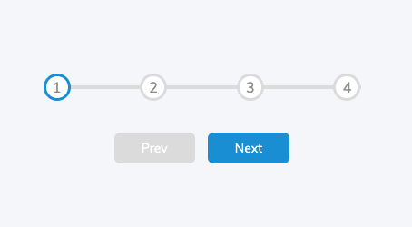
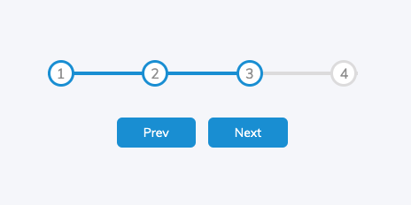
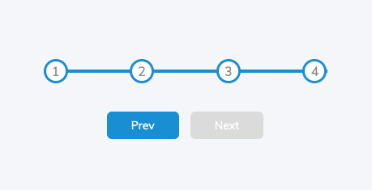

# Progress Steps Bar

This project is a simple progress steps that allow users to navigate from one step to the next.

## How it Works

The progress steps are created using HTML, CSS, and JavaScript. The HTML is used to create the progress bar and the individual steps. The CSS is used to style the progress bar and the steps, while the JavaScript is used to handle the navigation between steps.

## How to Use

To use the progress steps, simply click on the "Next" button to move to the next step. You can also click on the progress bar to navigate to a specific step.

## Troubleshooting

If you encounter any issues when using the progress steps, try clearing your browser cache or restarting your browser.

## Contributing

If you would like to contribute to the project, please submit a pull request on GitHub or report any bugs using the issue tracker.
